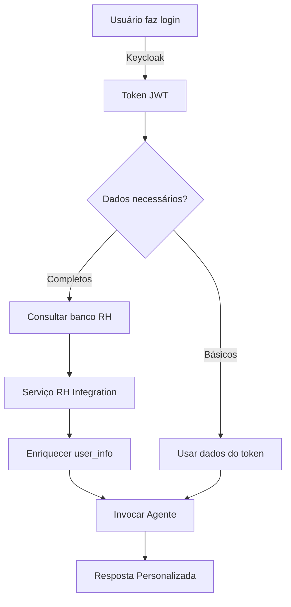

## 2.4 Integração Híbrida: Keycloak + Banco RH

### 🎯 Objetivo
Combinar autenticação do Keycloak com dados em tempo real do banco de RH para atendimento personalizado.

### 📊 Estratégia Híbrida

#### Dados do Keycloak (Estáticos)
- ✅ Nome, email, username
- ✅ Departamento, cargo
- ✅ Matrícula (employee_id)
- ✅ Gestor, centro de custo
- 🔄 Sincronizados diariamente

#### Dados do Banco RH (Dinâmicos)
- ✅ Salário, holerite
- ✅ Benefícios contratados
- ✅ Saldo de vales
- ✅ Histórico de férias
- ⚡ Consultados em tempo real

### 🔧 Implementação

#### Passo 1: Criar Tabela de Mapeamento

**Arquivo: `database/models.py`**

```python
class UserMapping(Base):
    __tablename__ = 'user_mapping'
    
    id = Column(Integer, primary_key=True)
    keycloak_user_id = Column(String(100), unique=True, index=True)
    employee_id = Column(String(50), unique=True, index=True)
    created_at = Column(DateTime, default=datetime.utcnow)
    updated_at = Column(DateTime, default=datetime.utcnow, onupdate=datetime.utcnow)
    last_sync = Column(DateTime)
```

**SQL para criar tabela:**

```sql
CREATE TABLE user_mapping (
    id SERIAL PRIMARY KEY,
    keycloak_user_id VARCHAR(100) UNIQUE NOT NULL,
    employee_id VARCHAR(50) UNIQUE NOT NULL,
    created_at TIMESTAMP DEFAULT CURRENT_TIMESTAMP,
    updated_at TIMESTAMP DEFAULT CURRENT_TIMESTAMP,
    last_sync TIMESTAMP
);

CREATE INDEX idx_user_mapping_keycloak ON user_mapping(keycloak_user_id);
CREATE INDEX idx_user_mapping_employee ON user_mapping(employee_id);
```

#### Passo 2: Script de Sincronização Keycloak ↔ RH

**Arquivo: `scripts/sync_keycloak_rh.py`** (novo)

```python
"""
Script para sincronizar dados do banco RH para o Keycloak.
Executar diariamente via cron/scheduler.
"""

from keycloak import KeycloakAdmin
import psycopg2
from datetime import datetime
import os
from dotenv import load_dotenv

load_dotenv()

# Conectar ao Keycloak
keycloak_admin = KeycloakAdmin(
    server_url=os.getenv("KEYCLOAK_SERVER_URL"),
    username="admin",
    password=os.getenv("KEYCLOAK_ADMIN_PASSWORD"),
    realm_name=os.getenv("KEYCLOAK_REALM"),
    verify=True
)

# Conectar ao banco RH (exemplo - ajuste conforme seu banco)
rh_conn = psycopg2.connect(
    host=os.getenv("RH_DB_HOST"),
    database=os.getenv("RH_DB_NAME"),
    user=os.getenv("RH_DB_USER"),
    password=os.getenv("RH_DB_PASSWORD")
)

# Conectar ao banco do assistente
app_conn = psycopg2.connect(os.getenv("DATABASE_URL"))

def sync_employee_to_keycloak():
    """Sincroniza dados de colaboradores do RH para o Keycloak."""
    
    rh_cur = rh_conn.cursor()
    app_cur = app_conn.cursor()
    
    # Buscar colaboradores ativos no banco RH
    rh_cur.execute("""
        SELECT 
            matricula,
            nome,
            email,
            departamento,
            cargo,
            data_admissao,
            gestor,
            centro_custo,
            status
        FROM colaboradores
        WHERE status = 'ATIVO'
    """)
    
    synced_count = 0
    error_count = 0
    
    for row in rh_cur.fetchall():
        matricula, nome, email, departamento, cargo, data_admissao, gestor, centro_custo, status = row
        
        try:
            # Buscar usuário no Keycloak por email
            users = keycloak_admin.get_users({"email": email})
            
            if not users:
                print(f"⚠️  Usuário não encontrado no Keycloak: {email}")
                continue
            
            user_id = users[0]['id']
            
            # Atualizar atributos no Keycloak
            keycloak_admin.update_user(user_id, {
                "attributes": {
                    "employee_id": matricula,
                    "department": departamento,
                    "job_title": cargo,
                    "admission_date": str(data_admissao),
                    "manager_name": gestor,
                    "cost_center": centro_custo,
                    "last_sync": datetime.now().isoformat()
                }
            })
            
            # Atualizar mapeamento no banco do assistente
            app_cur.execute("""
                INSERT INTO user_mapping (keycloak_user_id, employee_id, last_sync)
                VALUES (%s, %s, %s)
                ON CONFLICT (keycloak_user_id) 
                DO UPDATE SET 
                    employee_id = EXCLUDED.employee_id,
                    last_sync = EXCLUDED.last_sync,
                    updated_at = CURRENT_TIMESTAMP
            """, (user_id, matricula, datetime.now()))
            
            synced_count += 1
            print(f"✅ Sincronizado: {nome} ({matricula})")
            
        except Exception as e:
            error_count += 1
            print(f"❌ Erro ao sincronizar {email}: {str(e)}")
    
    app_conn.commit()
    
    print(f"\n📊 Resumo da Sincronização:")
    print(f"   ✅ Sincronizados: {synced_count}")
    print(f"   ❌ Erros: {error_count}")
    
    rh_cur.close()
    app_cur.close()

if __name__ == "__main__":
    print("🔄 Iniciando sincronização Keycloak ↔ RH...")
    sync_employee_to_keycloak()
    print("✅ Sincronização concluída!")
```

**Configurar cron (Linux/Mac):**

```bash
# Editar crontab
crontab -e

# Adicionar linha para executar diariamente às 2h da manhã
0 2 * * * cd /path/to/project && python scripts/sync_keycloak_rh.py >> logs/sync.log 2>&1
```

**Configurar Task Scheduler (Windows):**

```powershell
# Criar tarefa agendada
$action = New-ScheduledTaskAction -Execute "python" -Argument "scripts/sync_keycloak_rh.py" -WorkingDirectory "D:\Projetos_IA\CPQD\RH\Agente_Suporte_RH_Langgraphic"
$trigger = New-ScheduledTaskTrigger -Daily -At 2am
Register-ScheduledTask -TaskName "SyncKeycloakRH" -Action $action -Trigger $trigger
```

#### Passo 3: Serviço de Integração com Banco RH

**Arquivo: `services/rh_integration.py`** (novo)

```python
"""
Serviço para integração com banco de dados do RH.
Busca dados dinâmicos em tempo real.
"""

import psycopg2
from typing import Optional, Dict
import os
from dotenv import load_dotenv
from functools import lru_cache

load_dotenv()

class RHIntegration:
    """Serviço de integração com banco RH."""
    
    def __init__(self):
        self.rh_conn = psycopg2.connect(
            host=os.getenv("RH_DB_HOST"),
            database=os.getenv("RH_DB_NAME"),
            user=os.getenv("RH_DB_USER"),
            password=os.getenv("RH_DB_PASSWORD")
        )
        
        self.app_conn = psycopg2.connect(os.getenv("DATABASE_URL"))
    
    def get_employee_id(self, keycloak_user_id: str) -> Optional[str]:
        """Busca matrícula do colaborador pelo ID do Keycloak."""
        cur = self.app_conn.cursor()
        cur.execute("""
            SELECT employee_id 
            FROM user_mapping 
            WHERE keycloak_user_id = %s
        """, (keycloak_user_id,))
        
        result = cur.fetchone()
        cur.close()
        
        return result[0] if result else None
    
    def get_employee_benefits(self, employee_id: str) -> Dict:
        """Busca benefícios contratados do colaborador."""
        cur = self.rh_conn.cursor()
        cur.execute("""
            SELECT 
                plano_saude,
                plano_saude_tipo,
                dependentes_plano,
                vale_refeicao_valor,
                vale_alimentacao_valor,
                vale_transporte
            FROM beneficios
            WHERE matricula = %s
        """, (employee_id,))
        
        row = cur.fetchone()
        cur.close()
        
        if not row:
            return {}
        
        return {
            "health_plan": {
                "active": row[0],
                "type": row[1],
                "dependents": row[2]
            },
            "meal_voucher": row[3],
            "food_voucher": row[4],
            "transport_voucher": row[5]
        }
    
    def get_complete_employee_data(self, keycloak_user_id: str) -> Optional[Dict]:
        """Busca dados completos do colaborador."""
        employee_id = self.get_employee_id(keycloak_user_id)
        if not employee_id:
            return None
        
        benefits = self.get_employee_benefits(employee_id)
        
        return {
            "employee_id": employee_id,
            "benefits": benefits
        }
```

### 📊 Fluxo de Dados Híbrido



### ✅ Verificação

```python
# Testar integração
from services.rh_integration import RHIntegration

rh_service = RHIntegration()
keycloak_id = "a1b2c3d4-e5f6-7890-abcd-ef1234567890"
employee_data = rh_service.get_complete_employee_data(keycloak_id)

print(f"Benefícios: {employee_data['benefits']}")
```

---
