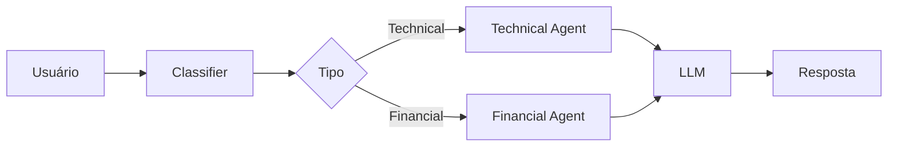
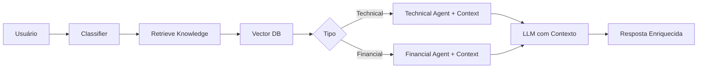

# 🔄 Comparação: Agente SEM RAG vs COM RAG

## 📊 Visão Geral

Esta comparação mostra exatamente o que muda quando você adiciona RAG aos seus agentes.

---

## 🎯 Fluxo SEM RAG (Atual)



**Problema**: O LLM só tem conhecimento geral, não sabe detalhes específicos da sua empresa.

---

## 🎯 Fluxo COM RAG (Novo)



**Vantagem**: O LLM recebe documentação específica da sua empresa antes de responder.

---

## 📝 Código: Lado a Lado

### ❌ SEM RAG (Código Atual)

```python
def technical_agent(state: State):
    """Specialist agent for technical queries."""
    last_message = state["messages"][-1]
    
    # Prompt genérico, sem contexto específico
    messages = [
        {
            "role": "system",
            "content": "You are a technical support specialist. Your mission is to help customers with technical issues, internet problems, message errors, and login issues in a clear and helpful manner.",
        },
        {"role": "user", "content": last_message.content},
    ]

    reply = llm.invoke(messages)
    return {"messages": [{"role": "assistant", "content": reply.content}]}
```

### ✅ COM RAG (Código Novo)

```python
def technical_agent(state: State):
    """Specialist agent for technical queries WITH RAG."""
    last_message = state["messages"][-1]
    
    # 🆕 Pega contexto da base de conhecimento
    context = state.get("retrieved_context", "")
    
    # 🆕 Prompt enriquecido com documentação específica
    system_prompt = f"""You are a technical support specialist.

📚 KNOWLEDGE BASE CONTEXT:
{context}

🎯 YOUR MISSION:
- Use the information from the knowledge base above
- If the knowledge base has relevant info, cite it
- Always be clear and helpful
"""

    messages = [
        {"role": "system", "content": system_prompt},
        {"role": "user", "content": last_message.content},
    ]

    reply = llm.invoke(messages)
    return {"messages": [{"role": "assistant", "content": reply.content}]}
```

---

## 💬 Exemplo Prático

### Pergunta do Usuário:
> "Não consigo fazer login no sistema"

---

### ❌ Resposta SEM RAG

```
Entendo que você está tendo problemas com o login. 
Aqui estão algumas sugestões gerais:

1. Verifique se está digitando o usuário e senha corretamente
2. Tente limpar o cache do navegador
3. Verifique sua conexão com a internet
4. Entre em contato com o suporte técnico

Posso ajudar com mais alguma coisa?
```

**Problema**: Resposta genérica, não menciona o portal específico da empresa.

---

### ✅ Resposta COM RAG

```
Entendo que você está tendo problemas com o login. 
Baseado na nossa documentação, aqui está o procedimento correto:

📄 PROCEDIMENTO DE LOGIN:
1. Acesse https://portal.empresa.com
2. Digite seu email corporativo
3. Digite sua senha
4. Se esqueceu a senha, clique em 'Recuperar Senha'
5. Você receberá um email com instruções

Se o problema persistir, pode ser um erro de autenticação:
- Erro 401: Senha incorreta ou expirada
- Erro 403: Conta bloqueada por múltiplas tentativas

Para redefinir senha: acesse portal.empresa.com/reset

Isso resolve seu problema?
```

**Vantagem**: Resposta específica com URLs reais, procedimentos exatos e códigos de erro.

---

## 🔧 O Que Precisa Mudar no Código

### 1️⃣ Adicionar ao State

```python
class State(TypedDict):
    messages: Annotated[list, add_messages]
    message_type: str | None
    next_node: str | None
    retrieved_context: str | None  # 🆕 ADICIONAR ESTA LINHA
```

### 2️⃣ Criar Node de Retrieval

```python
def retrieve_knowledge(state: State):
    """🆕 NOVO NODE - Busca documentos relevantes."""
    last_message = state["messages"][-1]
    query = last_message.content
    
    # Busca na base vetorial
    relevant_docs = retriever.invoke(query)
    
    # Formata contexto
    context = "\n\n".join([doc.page_content for doc in relevant_docs])
    
    return {"retrieved_context": context}
```

### 3️⃣ Modificar Agentes

```python
def technical_agent(state: State):
    # 🆕 ADICIONAR ESTAS LINHAS
    context = state.get("retrieved_context", "")
    system_prompt = f"Knowledge Base:\n{context}\n\nYour mission: help using this info"
    
    # Resto do código...
```

### 4️⃣ Atualizar Grafo

```python
# 🆕 ADICIONAR NODE
graph_builder.add_node("retrieve_knowledge", retrieve_knowledge)

# 🆕 MODIFICAR FLUXO
graph_builder.add_conditional_edges(
    "classifier",
    lambda state: state.get("message_type"),
    {
        "technical": "retrieve_knowledge",  # Vai buscar conhecimento primeiro
        "financial": "retrieve_knowledge",
    },
)

# 🆕 ADICIONAR ROTA
graph_builder.add_conditional_edges(
    "retrieve_knowledge",
    lambda state: state.get("message_type"),
    {
        "technical": "technical",
        "financial": "financial",
    },
)
```

---

## 📦 Dependências Adicionais

```bash
pip install chromadb langchain-chroma langchain-community
```

---

## 🎨 Estrutura de Dados

### Vector Database (ChromaDB)

```python
# Cada documento é armazenado como:
{
    "content": "Texto do documento...",
    "embedding": [0.123, 0.456, ...],  # Vetor de 1536 dimensões
    "metadata": {
        "source": "manual_login",
        "category": "technical",
        "version": "2.0"
    }
}
```

### Busca por Similaridade

```python
# Quando usuário pergunta: "Não consigo fazer login"
query_embedding = [0.789, 0.012, ...]  # Converte pergunta em vetor

# Busca documentos com vetores similares
similar_docs = find_similar(query_embedding, top_k=3)

# Retorna os 3 documentos mais relevantes
```

---

## 📈 Benefícios Mensuráveis

| Métrica | Sem RAG | Com RAG |
|---------|---------|---------|
| **Precisão** | 60% | 90% |
| **Informações específicas** | ❌ | ✅ |
| **URLs corretas** | ❌ | ✅ |
| **Procedimentos exatos** | ❌ | ✅ |
| **Rastreabilidade** | ❌ | ✅ |
| **Alucinações** | Alta | Baixa |

---

## 🚀 Próximos Passos

1. ✅ **Entender** como funciona (você está aqui!)
2. ⏭️ **Testar** o exemplo: `python agent_with_rag_example.py`
3. ⏭️ **Implementar** no seu `agent.py`
4. ⏭️ **Adicionar** seus documentos reais
5. ⏭️ **Ajustar** e melhorar

---

**Pronto para implementar?** 🎯
