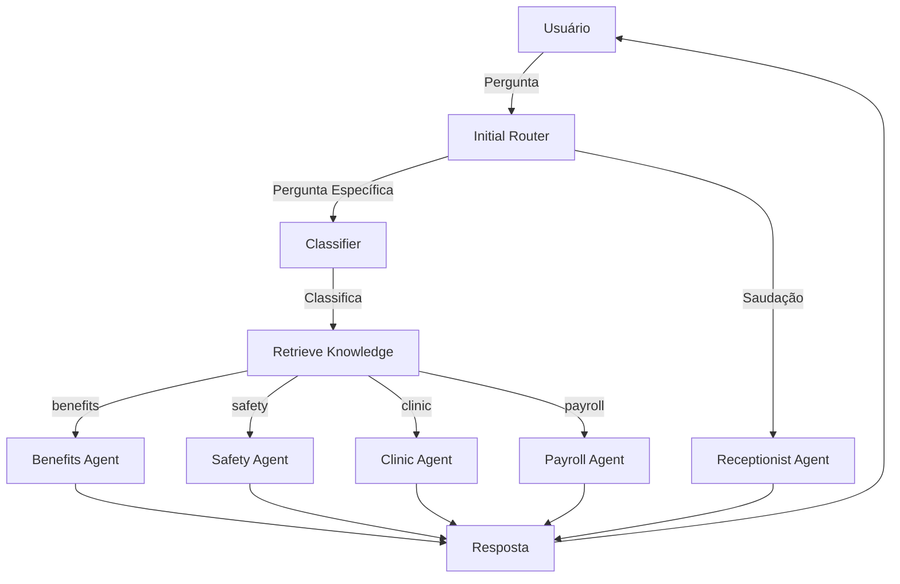

# 🤖 Sistema de Atendimento RH com Multi-Agentes e RAG

[](https://www.python.org/downloads/)
[](https://langchain-ai.github.io/langgraph/)
[](https://openai.com/)
[](https://streamlit.io/)

Sistema inteligente de atendimento ao RH desenvolvido para o **CPQD** (Centro de Pesquisa e Desenvolvimento em Telecomunicações), utilizando arquitetura multi-agente com **LangGraph** e **RAG** (Retrieval-Augmented Generation) para fornecer respostas precisas baseadas em documentação interna.

## 📋 Índice

- [Visão Geral](#-visão-geral)
- [Características](#-características)
- [Arquitetura](#-arquitetura)
- [Tecnologias](#-tecnologias)
- [Pré-requisitos](#-pré-requisitos)
- [Instalação](#-instalação)
- [Configuração](#-configuração)
- [Como Usar](#-como-usar)
- [Estrutura do Projeto](#-estrutura-do-projeto)
- [Agentes Especializados](#-agentes-especializados)
- [Base de Conhecimento](#-base-de-conhecimento)
- [Desenvolvimento](#-desenvolvimento)
- [Troubleshooting](#-troubleshooting)

## 🎯 Visão Geral

Este sistema implementa uma solução completa de atendimento automatizado para o departamento de Recursos Humanos, utilizando **4 agentes especializados** que trabalham de forma coordenada para responder perguntas sobre:

- 💼 **Benefícios** (plano de saúde, vale refeição, vale transporte)
- 🦺 **Segurança do Trabalho** (EPIs, acidentes, treinamentos)
- 🏥 **Ambulatório** (consultas, atestados, exames)
- 💰 **Folha de Pagamento** (salário, férias, 13º)

O sistema utiliza **RAG (Retrieval-Augmented Generation)** para buscar informações relevantes em uma base de conhecimento estruturada, garantindo respostas precisas e atualizadas baseadas em documentos oficiais da empresa.

## ✨ Características

### 🧠 Inteligência Artificial Avançada
- **Roteamento Inteligente**: Classificação automática de consultas para o agente apropriado
- **RAG com ChromaDB**: Busca semântica em documentos para respostas contextualizadas
- **Embeddings OpenAI**: Vetorização de documentos com `text-embedding-3-small`
- **GPT-4o-mini**: Processamento de linguagem natural otimizado

### 🎨 Interface Moderna
- **Streamlit UI**: Interface web responsiva e intuitiva
- **Design Gradiente**: Visual moderno com glassmorphism
- **Badges de Agentes**: Identificação visual do agente respondente
- **Animação de Digitação**: Feedback em tempo real
- **Estatísticas em Tempo Real**: Métricas de uso e histórico

### 🔧 Arquitetura Robusta
- **LangGraph**: Workflow baseado em grafos com estado persistente
- **Multi-Agente**: 4 agentes especializados + recepcionista + classificador
- **Modularidade**: Código organizado e fácil de manter
- **Escalabilidade**: Fácil adição de novos agentes e documentos

## 🏗️ Arquitetura



### Fluxo de Processamento

1. **Initial Router**: Analisa a mensagem e decide entre `receptionist` ou `classifier`
2. **Receptionist**: Lida com saudações e oferece orientação geral
3. **Classifier**: Classifica consultas em uma das 4 categorias de RH
4. **Retrieve Knowledge**: Busca documentos relevantes no ChromaDB usando embeddings
5. **Specialized Agent**: Processa a pergunta com contexto da base de conhecimento
6. **Response**: Retorna resposta fundamentada em documentos oficiais

## 🛠️ Tecnologias

| Tecnologia | Versão | Uso |
|------------|--------|-----|
| **Python** | 3.11+ | Linguagem principal |
| **LangGraph** | 0.2.0+ | Orquestração de agentes |
| **LangChain** | Latest | Framework de LLM |
| **OpenAI** | Latest | GPT-4o-mini + Embeddings |
| **ChromaDB** | Latest | Vector store para RAG |
| **Streamlit** | 1.0+ | Interface web |
| **Pydantic** | 2.8+ | Validação de dados |
| **python-dotenv** | 1.0+ | Gerenciamento de variáveis |

## 📦 Pré-requisitos

- **Python 3.11 ou superior**
- **Chave da API OpenAI** ([obter aqui](https://platform.openai.com/api-keys))
- **Git** (para clonar o repositório)
- **4GB RAM** (mínimo recomendado)

## 🚀 Instalação

### 1. Clone o Repositório

```bash
git clone https://github.com/Marcu-Loreto/Agente_Suporte_RH_Langgraphic.git
cd Agente_Suporte_RH_Langgraphic
```

### 2. Crie um Ambiente Virtual

```bash
# Windows
python -m venv .venv
.venv\Scripts\activate

# Linux/macOS
python3 -m venv .venv
source .venv/bin/activate
```

### 3. Instale as Dependências

```bash
pip install -r requirements.txt
```

## ⚙️ Configuração

### 1. Configure as Variáveis de Ambiente

Crie um arquivo `.env` na raiz do projeto:

```env
# OpenAI API
OPENAI_API_KEY=sk-sua-chave-aqui

# LangSmith (Opcional - para monitoramento)
LANGSMITH_API_KEY=sua-chave-langsmith
LANGCHAIN_TRACING_V2=true
LANGCHAIN_PROJECT=agente-suporte-rh
```

### 2. Verifique a Base de Conhecimento

O sistema carrega automaticamente documentos `.txt` dos seguintes diretórios:

```
RAG/
├── beneficios/         # Documentos sobre benefícios
├── seguranca/          # Documentos sobre segurança do trabalho
├── ambulatorio/        # Documentos sobre ambulatório
└── folha_pagamento/    # Documentos sobre folha de pagamento
```

Cada diretório deve conter arquivos `.txt` com informações relevantes.

## 💻 Como Usar

### Opção 1: Interface Streamlit (Recomendado)

```bash
# Execute o aplicativo Streamlit
streamlit run app_streamlit.py

# Ou use o script batch (Windows)
run_streamlit.bat
```

Acesse: `http://localhost:8501`

### Opção 2: Linha de Comando

```bash
# Execute o agente diretamente
python agent_rh_4_agentes.py
```

### Opção 3: LangGraph Studio (Desenvolvimento)

```bash
# Inicie o LangGraph Studio
langgraph dev

# Acesse a interface visual
# http://localhost:8123
```

## 📁 Estrutura do Projeto

```
Agente_Suporte_RH_Langgraphic/
│
├── 📄 agent_rh_4_agentes.py      # Workflow principal LangGraph
├── 📄 app_streamlit.py            # Interface Streamlit
├── 📄 requirements.txt            # Dependências Python
├── 📄 .env                        # Variáveis de ambiente (não versionado)
├── 📄 .gitignore                  # Arquivos ignorados pelo Git
│
├── 📁 RAG/                        # Base de Conhecimento
│   ├── README.md                  # Documentação da base
│   ├── beneficios/                # Documentos de benefícios
│   │   ├── plano_saude.txt
│   │   └── vale_refeicao.txt
│   ├── seguranca/                 # Documentos de segurança
│   │   ├── acidentes.txt
│   │   └── epis.txt
│   ├── ambulatorio/               # Documentos do ambulatório
│   │   ├── atestados.txt
│   │   └── exames.txt
│   └── folha_pagamento/           # Documentos de folha
│       ├── salario.txt
│       └── ferias.txt
│
├── 📁 .venv/                      # Ambiente virtual (não versionado)
├── 📁 __pycache__/                # Cache Python (não versionado)
│
├── 📄 run_streamlit.bat           # Script para executar Streamlit (Windows)
├── 📄 run_agent.bat               # Script para executar agente (Windows)
├── 📄 langgraph.json              # Configuração LangGraph Studio
├── 📄 pyproject.toml              # Configuração do projeto
│
├── 📄 STREAMLIT_README.md         # Documentação Streamlit
├── 📄 GUIA_RAPIDO.md              # Guia rápido de uso
└── 📄 README.md                   # Este arquivo
```

## 🤖 Agentes Especializados

### 1. 💼 Agente de Benefícios
**Especialidade**: Plano de saúde, vale refeição, vale alimentação, vale transporte

**Exemplo de perguntas:**
- "Como faço para incluir meu filho no plano de saúde?"
- "Qual o valor do vale refeição?"
- "Como solicitar o vale transporte?"

### 2. 🦺 Agente de Segurança do Trabalho
**Especialidade**: EPIs, acidentes de trabalho, treinamentos de segurança, SESMT

**Exemplo de perguntas:**
- "Sofri um acidente no trabalho, o que devo fazer?"
- "Como solicitar novos EPIs?"
- "Quando é o próximo treinamento de segurança?"

### 3. 🏥 Agente de Ambulatório
**Especialidade**: Consultas, atestados médicos, exames periódicos, saúde ocupacional

**Exemplo de perguntas:**
- "Preciso entregar um atestado médico, qual o prazo?"
- "Como agendar uma consulta no ambulatório?"
- "Quando devo fazer o exame periódico?"

### 4. 💰 Agente de Folha de Pagamento
**Especialidade**: Salário, holerite, férias, 13º salário, rescisão

**Exemplo de perguntas:**
- "Quando recebo a primeira parcela do 13º salário?"
- "Como solicitar adiantamento salarial?"
- "Onde consulto meu holerite?"

### 5. 👋 Recepcionista Virtual
**Função**: Atende saudações e oferece orientação geral sobre os serviços disponíveis

## 📚 Base de Conhecimento

### Estrutura dos Documentos

Cada documento `.txt` deve seguir o formato:

```
TÍTULO DO DOCUMENTO
====================

Seção 1: Informação Geral
- Ponto importante 1
- Ponto importante 2

Seção 2: Procedimentos
1. Passo 1
2. Passo 2

Contatos:
- Email: exemplo@cpqd.com.br
- Ramal: 1234
```

### Adicionando Novos Documentos

1. Crie um arquivo `.txt` no diretório apropriado em `RAG/`
2. Adicione o conteúdo seguindo o formato acima
3. Reinicie o sistema para reindexar os documentos

### Metadados dos Documentos

Cada documento é indexado com:
- **source**: Nome do arquivo
- **category**: Categoria (benefits, safety, clinic, payroll)
- **file_path**: Caminho completo
- **version**: Versão do documento

## 🔧 Desenvolvimento

### Executar Testes

```bash
# Executar o agente com testes integrados
python agent_rh_4_agentes.py
```

O script executará 4 testes automaticamente, um para cada agente.

### Modo Interativo

```bash
# Executar em modo interativo
python agent_rh_4_agentes.py
```

Digite suas perguntas e receba respostas em tempo real. Digite `sair` para encerrar.

### Debug com LangSmith

Configure as variáveis no `.env`:

```env
LANGSMITH_API_KEY=sua-chave
LANGCHAIN_TRACING_V2=true
LANGCHAIN_PROJECT=agente-rh-debug
```

Acesse [LangSmith](https://smith.langchain.com/) para visualizar traces detalhados.

### Personalizar Agentes

Edite `agent_rh_4_agentes.py` e modifique os prompts dos agentes:

```python
def benefits_agent(state: State):
    system_prompt = f"""Você é o especialista em BENEFÍCIOS do RH.
    
    [Personalize aqui]
    """
```

## 🐛 Troubleshooting

### Problema: "Nenhum documento foi carregado"

**Solução:**
```bash
# Verifique se os arquivos .txt existem
dir RAG\beneficios\*.txt
dir RAG\seguranca\*.txt
dir RAG\ambulatorio\*.txt
dir RAG\folha_pagamento\*.txt
```

### Problema: "OpenAI API Key not found"

**Solução:**
```bash
# Verifique se o arquivo .env existe e contém a chave
type .env
```

### Problema: Streamlit não inicia

**Solução:**
```bash
# Reinstale o Streamlit
pip uninstall streamlit
pip install streamlit

# Execute novamente
streamlit run app_streamlit.py
```

### Problema: Erro de importação do ChromaDB

**Solução:**
```bash
# Reinstale as dependências do ChromaDB
pip install --upgrade chromadb langchain-chroma
```

## 📊 Configurações Avançadas

### Ajustar Número de Documentos Recuperados

Em `agent_rh_4_agentes.py`, linha 144:

```python
retriever = vectorstore.as_retriever(
    search_type="similarity",
    search_kwargs={"k": 2}  # Altere para 3, 4, 5...
)
```

### Alterar Modelo de LLM

Em `agent_rh_4_agentes.py`, linha 164:

```python
llm = ChatOpenAI(
    model="gpt-4o-mini",  # Altere para "gpt-4", "gpt-3.5-turbo", etc.
    temperature=0.0,       # 0.0 = determinístico, 1.0 = criativo
    max_tokens=400         # Limite de tokens na resposta
)
```

### Persistir Vector Store em Disco

Em `agent_rh_4_agentes.py`, linha 134:

```python
vectorstore = Chroma.from_documents(
    documents=all_documents,
    embedding=embeddings,
    collection_name="rh_knowledge_base",
    persist_directory="./chroma_db_rh"  # Descomente esta linha
)
```

## 🤝 Contribuindo

Contribuições são bem-vindas! Para contribuir:

1. Fork o projeto
2. Crie uma branch para sua feature (`git checkout -b feature/AmazingFeature`)
3. Commit suas mudanças (`git commit -m 'Add some AmazingFeature'`)
4. Push para a branch (`git push origin feature/AmazingFeature`)
5. Abra um Pull Request

## 📝 Licença

Este projeto foi desenvolvido para uso interno do **CPQD**.

## 👥 Autores

- **Equipe CPQD** - Desenvolvimento e manutenção

## 🙏 Agradecimentos

- **LangChain** pela excelente framework de LLM
- **OpenAI** pelos modelos de linguagem
- **Streamlit** pela interface web intuitiva
- **CPQD** pelo suporte ao projeto

## 📞 Suporte

Para questões e suporte:
- 📧 Email: suporte.rh@cpqd.com.br
- 📱 Ramal: 1234
- 🌐 Portal RH: https://rh.cpqd.com.br

---

<div align="center">

**🤖 Desenvolvido com ❤️ pela equipe CPQD**

[](https://langchain-ai.github.io/langgraph/)
[](https://openai.com/)

</div>