# Arquitetura da Solução — Assistente Virtual de RH (CPQD)

## Resumo Executivo

Sistema multiagente de atendimento de Recursos Humanos baseado em RAG (Retrieval-Augmented Generation) e LangGraph. O sistema recebe perguntas de colaboradores do CPQD sobre temas de RH, classifica a intenção, recupera conhecimento relevante de uma base vetorial e direciona para um agente especializado que formula a resposta final. A interface é web (Streamlit) e a observabilidade é provida pelo Langfuse.

---

## Diagrama de Arquitetura (Mermaid)

```mermaid
%%{init: {'theme': 'base', 'themeVariables': {'primaryColor': '#1e3a5f', 'primaryTextColor': '#fff', 'primaryBorderColor': '#1e3a5f', 'lineColor': '#4a90d9', 'secondaryColor': '#e8f4fd', 'tertiaryColor': '#f0f7ff'}}}%%

graph LR
    %% ═══════════════════════════════════════════════════════════════
    %% CAMADA DE APRESENTAÇÃO
    %% ═══════════════════════════════════════════════════════════════
    subgraph FRONTEND["🖥️ Camada de Apresentação"]
        direction TB
        USER[👤 Colaborador CPQD]
        STREAMLIT["Streamlit UI<br/>(app_streamlit.py)"]
        USER -->|pergunta| STREAMLIT
        STREAMLIT -->|resposta| USER
    end

    %% ═══════════════════════════════════════════════════════════════
    %% ORQUESTRAÇÃO (LANGGRAPH)
    %% ═══════════════════════════════════════════════════════════════
    subgraph ORCHESTRATION["⚙️ Orquestração LangGraph"]
        direction TB
        ROUTER["Initial Router<br/>(LLM Simple)"]
        RECEPTIONIST["Recepcionista<br/>(Saudação / Small Talk)"]
        CLASSIFIER["Classificador<br/>(LLM Simple + Structured Output)"]
        REWRITER["Query Rewriter<br/>(LLM Medium)"]
    end

    %% ═══════════════════════════════════════════════════════════════
    %% RAG — RETRIEVAL
    %% ═══════════════════════════════════════════════════════════════
    subgraph RAG["🔍 RAG — Retrieval"]
        direction TB
        RETRIEVER["Retrieve Knowledge<br/>(Multi-Query + Score Ranking)"]
        VECTORDB[("ChromaDB<br/>Vector Store")]
        EMBEDDINGS["OpenAI Embeddings<br/>(text-embedding-3-small)"]
        RETRIEVER -->|similarity search| VECTORDB
        EMBEDDINGS -.->|gera vetores| VECTORDB
    end

    %% ═══════════════════════════════════════════════════════════════
    %% AGENTES ESPECIALIZADOS
    %% ═══════════════════════════════════════════════════════════════
    subgraph AGENTS["🤖 Agentes Especializados (LLM Complex)"]
        direction TB
        BENEFITS["💼 Benefícios"]
        SAFETY["🦺 Segurança do Trabalho"]
        CLINIC["🏥 Ambulatório"]
        PAYROLL["💰 Folha de Pagamento"]
        VACATION["🏖️ Férias"]
    end

    %% ═══════════════════════════════════════════════════════════════
    %% BASE DE CONHECIMENTO (INGESTION)
    %% ═══════════════════════════════════════════════════════════════
    subgraph KNOWLEDGE["📚 Base de Conhecimento"]
        direction TB
        TXT_FILES["Arquivos .txt<br/>(benefícios, segurança,<br/>ambulatório, folha)"]
        CSV_FILES["Arquivos .csv<br/>(férias)"]
        LOADER["Document Loader<br/>(load_documents_from_directory<br/>load_csv_documents)"]
        TXT_FILES --> LOADER
        CSV_FILES --> LOADER
    end

    %% ═══════════════════════════════════════════════════════════════
    %% OBSERVABILIDADE
    %% ═══════════════════════════════════════════════════════════════
    subgraph OBSERVABILITY["📊 Observabilidade"]
        direction TB
        LANGFUSE["Langfuse<br/>(Traces, Custos, Latência)"]
    end

    %% ═══════════════════════════════════════════════════════════════
    %% POOL DE LLMs
    %% ═══════════════════════════════════════════════════════════════
    subgraph LLMPOOL["🧠 Pool de LLMs"]
        direction TB
        LLM_SIMPLE["Simple<br/>(MiniMax M2.5 / GPT-4o-mini)"]
        LLM_MEDIUM["Medium<br/>(GPT-4o-mini)"]
        LLM_COMPLEX["Complex<br/>(GPT-4o-mini / GPT-4o)"]
    end

    %% ═══════════════════════════════════════════════════════════════
    %% CONEXÕES PRINCIPAIS
    %% ═══════════════════════════════════════════════════════════════
    STREAMLIT -->|invoke graph| ROUTER
    ROUTER -->|small talk| RECEPTIONIST
    ROUTER -->|HR question| CLASSIFIER
    CLASSIFIER -->|categoria| REWRITER
    REWRITER -->|queries expandidas| RETRIEVER
    RETRIEVER -->|context + category| AGENTS
    AGENTS -->|resposta final| STREAMLIT

    %% Conexões de LLM
    ROUTER -.->|usa| LLM_SIMPLE
    CLASSIFIER -.->|usa| LLM_SIMPLE
    REWRITER -.->|usa| LLM_MEDIUM
    AGENTS -.->|usa| LLM_COMPLEX

    %% Ingestion
    LOADER -->|Documents + Metadata| EMBEDDINGS

    %% Observabilidade
    ORCHESTRATION -.->|traces| LANGFUSE
    AGENTS -.->|traces| LANGFUSE
```



---

## Componentes

| Componente                 | Papel                                                      | Entrada                                      | Saída                                                       | Tipo                     |
| -------------------------- | ---------------------------------------------------------- | -------------------------------------------- | ----------------------------------------------------------- | ------------------------ |
| **Streamlit UI**           | Interface web do colaborador                               | Pergunta em texto livre                      | Resposta formatada com badge do agente                      | Runtime / Apresentação   |
| **Initial Router**         | Decide se a mensagem é conversa casual ou pergunta de RH   | Mensagem do usuário                          | `receptionist` ou `classifier`                              | Runtime / Orquestração   |
| **Recepcionista**          | Responde saudações e small talk com contexto de horário    | Mensagem + horário São Paulo                 | Resposta cordial                                            | Runtime / Agente         |
| **Classificador**          | Categoriza a pergunta em 5 domínios de RH                  | Mensagem do usuário                          | Enum: `benefits`, `safety`, `clinic`, `payroll`, `vacation` | Runtime / Orquestração   |
| **Query Rewriter**         | Expande a pergunta em 3 variações semânticas por categoria | Pergunta original + vocabulário da categoria | Lista de 3 queries reformuladas                             | Runtime / RAG            |
| **Retrieve Knowledge**     | Busca multi-query com deduplicação e ranking por score     | Queries originais + reescritas               | Top 4 documentos com score                                  | Runtime / RAG            |
| **ChromaDB**               | Vector store em memória com embeddings dos documentos      | Queries vetorizadas                          | Documentos similares + distância                            | Persistente / Dados      |
| **Agentes Especializados** | Geram a resposta final usando contexto RAG + system prompt | Pergunta + contexto recuperado + horário     | Resposta especializada em pt-BR                             | Runtime / Agente         |
| **Document Loader**        | Carrega .txt e .csv da pasta RAG/ no boot                  | Arquivos do filesystem                       | Objetos Document com metadata                               | Inicialização / Ingestão |
| **OpenAI Embeddings**      | Converte texto em vetores semânticos                       | Texto dos documentos / queries               | Vetores (text-embedding-3-small)                            | Runtime / IA             |
| **Pool de LLMs**           | Gerencia 3 níveis de complexidade com fallback             | Configuração .env                            | Instâncias ChatOpenAI                                       | Runtime / Infraestrutura |
| **Langfuse**               | Captura traces, custos e latência de cada execução         | Callbacks do LangChain                       | Dashboard de observabilidade                                | Observabilidade          |

---

## Fluxo Principal

```
1. Colaborador digita pergunta → Streamlit UI
2. Streamlit invoca o grafo LangGraph (app.invoke)
3. Initial Router (LLM Simple) decide:
   • Small talk → Recepcionista → Resposta → FIM
   • Pergunta RH → Classificador
4. Classificador (LLM Simple) categoriza: benefits | safety | clinic | payroll | vacation
5. Query Rewriter (LLM Medium) gera 3 variações semânticas da pergunta
6. Retrieve Knowledge executa busca multi-query no ChromaDB:
   • Roda cada query (original + 3 variações)
   • Agrega resultados, deduplica, ordena por similaridade
   • Retorna top 4 documentos com scores
7. Agente Especializado (LLM Complex) recebe:
   • System prompt carregado de /prompts/{agente}.md
   • Contexto RAG recuperado
   • Horário atual (São Paulo)
   • Pergunta original do colaborador
8. Agente gera resposta final em pt-BR
9. Streamlit exibe resposta com badge visual do agente que respondeu
```

---

## Fluxos Secundários

### Ingestão de Conhecimento (Boot)

```
1. Sistema lê RAG_BASE_DIR (./RAG/)
2. Para cada subpasta (beneficios, seguranca, ambulatorio, folha_pagamento):
   • Carrega arquivos .txt → Document(page_content, metadata)
3. Para ferias/:
   • Carrega .csv → 1 Document por linha (campos formatados como "coluna: valor")
4. Todos os Documents são embedados via OpenAI text-embedding-3-small
5. ChromaDB indexa em memória (collection: rh_knowledge_base)
```

### Telemetria Langfuse (Opcional)

```
1. No boot, verifica LANGFUSE_PUBLIC_KEY + LANGFUSE_SECRET_KEY
2. Se presentes: inicializa CallbackHandler
3. Cada invoke do grafo envia traces automaticamente
4. Dados disponíveis: prompts, completions, tokens, latência, custos
```

### Fallback de LLM

```
1. Pool de LLMs tenta provedor configurado (ex: MiniMax para simple)
2. Se API key ausente → fallback para modelo OpenAI equivalente
3. Log de warning no boot sobre qual modelo está ativo em cada nível
```

---

## Decisões de Design

| Decisão                                  | Justificativa                                                                                                                        |
| ---------------------------------------- | ------------------------------------------------------------------------------------------------------------------------------------ |
| **LangGraph como orquestrador**          | Grafo explícito com estado tipado (TypedDict) permite fluxo condicional claro, debugging visual e extensibilidade para novos agentes |
| **Pool de LLMs por complexidade**        | Otimiza custo: tarefas determinísticas usam modelos baratos/gratuitos; respostas finais usam modelos premium                         |
| **Query Rewriting antes do retrieval**   | Expande vocabulário semântico da pergunta, melhorando recall do RAG — especialmente importante para jargão de RH                     |
| **Multi-query com deduplicação**         | Combinar resultados de múltiplas queries aumenta precisão sem duplicar documentos no contexto                                        |
| **Prompts em arquivos .md externos**     | Desacopla conteúdo de código: permite editar/versionar prompts sem alterar Python                                                    |
| **ChromaDB em memória**                  | Simplifica setup para desenvolvimento; base de conhecimento é pequena (~8 documentos) e cabe em RAM                                  |
| **Streamlit como frontend**              | Prototipagem rápida com UX conversacional; adequado para MVP interno no CPQD                                                         |
| **Langfuse opcional**                    | Não bloqueia execução se credenciais ausentes; ativa observabilidade sem impacto em ambientes locais                                 |
| **Timezone contextualizado (São Paulo)** | Humaniza saudações e dá contexto temporal ao agente                                                                                  |

---

## Arquitetura de Dados

### Fontes de Conhecimento

| Categoria   | Formato | Arquivos                                                                | Conteúdo                                     |
| ----------- | ------- | ----------------------------------------------------------------------- | -------------------------------------------- |
| Benefícios  | .txt    | `Plano_beneficio_concessao.txt`, `plano_saude.txt`, `vale_refeicao.txt` | Regras de benefícios, planos, elegibilidade  |
| Segurança   | .txt    | `acidentes.txt`, `epis.txt`                                             | Normas de segurança, EPIs, procedimentos     |
| Ambulatório | .txt    | `atestados.txt`, `horarios.txt`                                         | Regras de atestados, horários de atendimento |
| Folha       | .txt    | `salario.txt`                                                           | Informações sobre salário, holerite          |
| Férias      | .csv    | `ferias_dataser - Sheet1.csv`                                           | Dados tabulares de férias dos colaboradores  |

### Modelo de Estado (LangGraph)

```python
class State(TypedDict):
    messages: Annotated[list, add_messages]   # Histórico de mensagens
    message_type: str | None                  # Categoria classificada
    next_node: str | None                     # Próximo nó do grafo
    retrieved_context: str | None             # Contexto RAG recuperado
    rewritten_queries: list[str] | None       # Queries expandidas
    current_time: str | None                  # Horário formatado
    greeting: str | None                      # Cumprimento contextual
```

---

## Stack Tecnológica

| Camada          | Tecnologia                 | Versão/Modelo          |
| --------------- | -------------------------- | ---------------------- |
| Frontend        | Streamlit                  | —                      |
| Orquestração    | LangGraph                  | —                      |
| LLM (Simple)    | MiniMax M2.5 / GPT-4o-mini | Fallback automático    |
| LLM (Medium)    | GPT-4o-mini                | —                      |
| LLM (Complex)   | GPT-4o-mini / GPT-4o       | Configurável via .env  |
| Embeddings      | OpenAI                     | text-embedding-3-small |
| Vector Store    | ChromaDB                   | Em memória             |
| Observabilidade | Langfuse                   | Cloud ou self-hosted   |
| Runtime         | Python 3.12+               | —                      |
| Validação       | Pydantic v2                | Structured Output      |

---

## Gaps para Produção

Itens ausentes ou insuficientes para uma versão production-ready:

1. Guardrails de entrada (detecção de prompt injection, input sanitization, content moderation)
2. Guardrails de saída (validação de resposta, filtro de alucinações, check de compliance)
3. Roteamento inteligente de LLMs (cost-aware routing, fallback chain, rate-limit handling, circuit breaker)
4. Autenticação e autorização (JWT, RBAC, SSO corporativo)
5. Persistência de sessão e histórico de conversas (banco de dados)
6. API REST/GraphQL desacoplada do frontend (FastAPI)
7. Vector store persistente e escalável (Chroma Server, Qdrant ou Weaviate)
8. Cache de respostas e embeddings (Redis)
9. Rate limiting e throttling por usuário
10. Ingestão automatizada de documentos (pipeline ETL, versionamento de knowledge base)
11. Chunking inteligente com overlap e metadata enrichment
12. Reranker (cross-encoder) após retrieval para melhorar precisão
13. Feedback loop do usuário (thumbs up/down, correções → fine-tuning / prompt improvement)
14. Logging estruturado (structlog JSON → ELK/Loki)
15. Métricas e alertas (OpenTelemetry, Prometheus, Grafana)
16. Audit trail (quem perguntou o quê, qual agente respondeu, qual contexto usou)
17. Testes automatizados (unit, integration, eval de qualidade de resposta)
18. CI/CD pipeline
19. Containerização (Docker + Docker Compose)
20. Health checks e readiness probes
21. Secrets management (Vault, AWS Secrets Manager)
22. Multi-tenancy (suportar múltiplas áreas/empresas)
23. Escalabilidade horizontal (workers async, filas)
24. Human-in-the-loop para perguntas de alta sensibilidade
25. Versionamento de prompts com A/B testing
26. Gestão de contexto e memória de longo prazo (summarization, sliding window)
27. Fallback gracioso quando nenhum documento é relevante (escalada para humano)
28. Suporte a múltiplos idiomas (internacionalização)
29. Documentação de API (OpenAPI/Swagger)
30. Política de retry e dead-letter queue para chamadas de LLM
31. Data governance (LGPD, anonimização, retenção, consentimento)
32. Monitoramento de drift de qualidade das respostas ao longo do tempo

---

## Premissas e Limitações (POC Atual)

### Premissas

- A base de conhecimento é mantida manualmente (arquivos .txt e .csv na pasta RAG/).
- O volume de acessos é baixo (uso interno CPQD), não exigindo escalabilidade horizontal.
- Todos os colaboradores interagem em Português do Brasil.
- A conexão com APIs da OpenAI/MiniMax é estável.

### Limitações

- **Sem persistência de sessão**: o histórico de conversa existe apenas na session do Streamlit (memória do navegador). Ao recarregar, perde-se o histórico.
- **ChromaDB em memória**: a cada restart do servidor, os embeddings são recalculados. Para bases maiores, persistir em disco ou usar Chroma Server.
- **Sem autenticação**: qualquer pessoa com acesso à URL pode interagir com o sistema.
- **Sem feedback loop**: não há mecanismo para o colaborador avaliar a resposta, impedindo melhoria contínua automatizada.
- **Contexto limitado**: o retriever retorna top 4 documentos; perguntas complexas que exigem cruzamento de múltiplas fontes podem ter respostas incompletas.

---

## Checklist de Validação

- [x] Componentes preservados conforme código-fonte
- [x] Conexões validadas contra o grafo LangGraph real
- [x] Nenhuma seta extra ou componente inventado
- [x] Layout legível da esquerda para direita (fluxo principal)
- [x] Lógica técnica preservada: Router → Classifier → Rewriter → Retriever → Agent
- [x] RAG com ingestion e runtime separados
- [x] Pool de LLMs com 3 níveis documentados
- [x] Observabilidade (Langfuse) como camada opcional e não-bloqueante
- [x] Decisões de design justificadas

---

## Prompt para Geração Visual (Ferramentas Externas)

Para gerar uma imagem executiva deste diagrama em ferramentas como DALL-E, Midjourney ou similar:

```text
Create a clean, executive-ready solution architecture diagram in landscape format.

Goal: Represent an HR virtual assistant system with multi-agent RAG architecture.

Style: Modern enterprise architecture infographic, white background, dark blue primary flow lines, rounded rectangles, subtle icons, clear typography. Color semantics: dark blue for orchestration (Router, Classifier), light blue for RAG retrieval, green for user/response, orange for tools/actions, purple for prompts/system instructions, gray for observability.

Layout: Left-to-right main flow. Five zones separated by containers:
1. USER LAYER (left): Collaborator → Streamlit UI
2. ORCHESTRATION (center-left): Initial Router → Receptionist OR Classifier → Query Rewriter
3. RAG RETRIEVAL (center): Multi-Query Search → ChromaDB Vector Store ← OpenAI Embeddings ← Document Loader ← Knowledge Files (RAG/)
4. SPECIALIST AGENTS (center-right): 5 agents (Benefits, Safety, Clinic, Payroll, Vacation) each using LLM Complex + System Prompt + RAG Context
5. OBSERVABILITY (bottom): Langfuse traces connected to all LLM calls via dashed lines

Flow: User → Streamlit → Router → (Receptionist → END) OR (Classifier → Rewriter → Retriever → Agent → Streamlit → User)

LLM Pool shown as a separate bottom-left box with 3 levels (Simple, Medium, Complex) connected via dashed lines to their consumers.

Rules: No overlapping boxes. Every arrow represents a real data flow. Keep labels short. Use Portuguese (BR) for component names.
```

---

_Documento gerado em 29/06/2026 — Projeto: Assistente Virtual RH CPQD_
